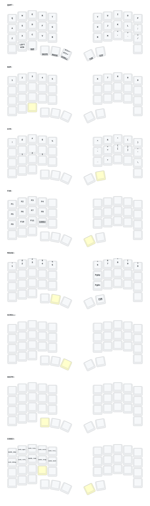

This keeb created by a group of people who loves keyball.

Special Thanks to:  
PCB: *[yangxing844](https://github.com/yangxing844)*  
Case: *[delock](https://github.com/delock)*  
Firmware: *[Amos698](https://github.com/Amos698)*  

## Layers

The default layer keeps ordinary macOS modifiers intact:

- `LCTRL`, `LGUI` (Command), and `LALT` (Option) remain normal keys
- hold Escape for `SNIPE`
- hold Space for `MOUSE`
- hold Alt+Grave for `SCROLL` (tap emits Command+Grave for macOS window cycling)
- Enter remains Enter
- hold Backspace for `SYM`

The right-half trackball continues to activate the mouse, scroll, and snipe
layers according to its existing PMW3610 configuration. This board has no RGB
LEDs, rotary encoder, joystick, or touch input, so live agent-status lighting
and dial/joystick controls are intentionally out of scope for this firmware.

### macOS Command layer

Press Left Ctrl+Left Option together to arm a one-shot `CMD` layer for the
next keypress. It contains direct macOS shortcuts, so no host automation is
needed for the basic actions:

| Key | Action |
| --- | --- |
| Q / W | Command+Q / Command+W |
| E / R | Command+Tab / Command+Shift+Tab |
| T | Command+Grave (cycle windows in the current app) |
| Y–P | Command+1 through Command+5 |
| A–; | Command+C, V, X, Z, A, S, F, Backspace, Left, Right |
| Z–B | Command+N, O, S, F, P |
| N–/ | Command+G, H, M, [, ] |

From the `CMD` layer, the bottom-left positions arm the existing `NUM` or
`FUN` layer for the following keypress. The layer uses ZMK's combo and sticky
layer behaviors, which preserve the base typing layout while adding shortcuts.
Codex Micro-specific live RGB status, agent approvals, and reasoning controls
still require host/application integration or hardware that this Keyball does
not have.
